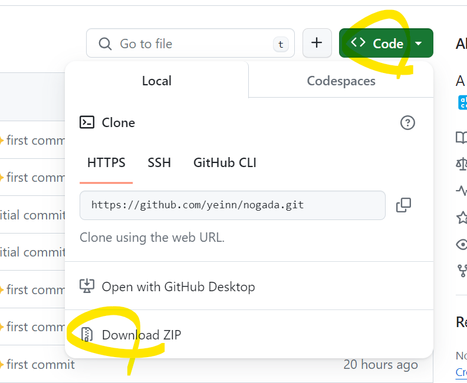

# NO!GADA

반복적인 노가다 업무를 대체하기 위한 데이터 자동 입력 툴입니다.

엑셀에 키워드별 데이터를 입력하고 워드 문서에 키워드를 사용해 템플릿을 생성한 뒤
노가다에 두 개의 파일을 업로드하면 키워드가 입력된 워드 문서가 생성됩니다.

이 툴로 많은 사람들이 업무 시간을 더 의미있는 일에 사용하길 바랍니다.

*현재 빌드 문제로 개발 환경에서만 정상 동작하니 참고하시길 바랍니다.

# 개발 환경

- node v18.17.0
- pnpm v8.14.3

# 환경 구성

1. 소스코드 다운로드

## 사용 방법

